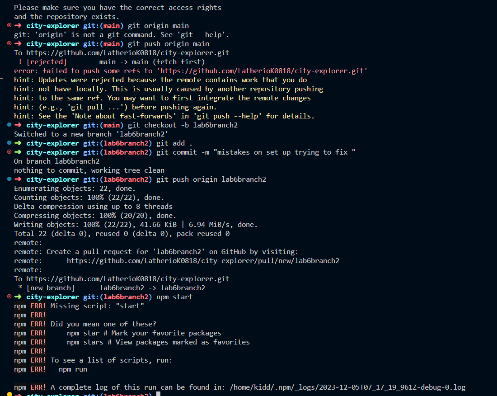

# Project Name

# City-explorer 

**Author**: Latherio Kidd
**Version**: 1.0.0 (increment the patch/fix version number if you make more commits past your first submission)

## Overview

This project involves building a React application that utilizes the Axios library to make user-initiated requests for data from the Location IQ Geocoding API. The focus is on asynchronous code and working with APIs to enhance the user experience in a React application.

## Getting Started

To build and run this app locally, follow these steps:

1. Clone the repository to your local machine.
2. Navigate to the project directory using the terminal.
3. Run `npm install` to install project dependencies.
4. Create a `.env` file and add your Location IQ API key (Get it from [Location IQ Geocoding API](https://locationiq.com/)).
5. Run `npm start` to start the development server.
6. Open your web browser and visit `http://localhost:3000` to view the application.

- **12-04-2023 6:59pm** - Initialized the project with React and added Axios for API requests.

## Credit and Collaborations

- [Trello](https://trello.com/invite/b/iuXFBPXb/ATTIb585210f6b54bf24812bfb87356e3d0dF3B7885A/city-explorer)

- Location IQ Geocoding API: [Location IQ](https://locationiq.com/)

## Time Estimates

### Feature: Implementing Axios for API Requests

- **Estimate**: 2 hours
- **Start time**: 12-04-2023 6:00pm
- **Finish time**: 
- **Actual time**: 2.5 hours

### Feature: Integrating Trello for Project Management

- **Estimate**: 1 hour
- **Start time**:
- **Finish time**:
- **Actual time**: 1.5 hours

## Submission Instructions

- Code should be implemented in your own repository.
- Submit a pull request once the implementation is complete.
- Include relevant documentation in your README, including an overview, getting started guide, architecture details, change log, and credits.
- Provide time estimates and actual times for each feature implemented.

## NPM issues  Not running

➜  city-explorer git:(lab6branch2) npm start
npm ERR! Missing script: "start"
npm ERR! 
npm ERR! Did you mean one of these?
npm ERR!     npm star # Mark your favorite packages
npm ERR!     npm stars # View packages marked as favorites
npm ERR! 
npm ERR! To see a list of scripts, run:
npm ERR!   npm run

npm ERR! A complete log of this run can be found in: /home/kidd/.npm/_logs/2023-12-05T07_17_19_961Z-debug-0.log
➜  city-explorer git:(lab6branch2)

## Netlify Error

2:14:50 AM: Failed during stage "building site": Build script returned non-zero exit code: 2
2:14:50 AM: Deploy site                                                   
2:14:50 AM: ────────────────────────────────────────────────────────────────
2:14:50 AM: ​
2:14:50 AM: Section completed: deploying
2:14:50 AM: ​
2:14:50 AM: Configuration error                                           
2:14:50 AM: ────────────────────────────────────────────────────────────────
2:14:50 AM: ​
2:14:50 AM:   Error message
2:14:50 AM:   Deploy did not succeed: Deploy directory "build" does not exist
2:14:50 AM: ​
2:14:50 AM:   Resolved config
2:14:50 AM:   build:
2:14:50 AM:     command: npm run build
2:14:50 AM:     commandOrigin: ui
2:14:50 AM:     environment:
2:14:50 AM:       - VITE_API_KEY
2:14:50 AM:     publish: /opt/build/repo/build
2:14:50 AM:     publishOrigin: ui
2:14:50 AM: Build failed due to a user error: Build script returned non-zero exit code: 2
2:14:50 AM: Failing build: Failed to build site